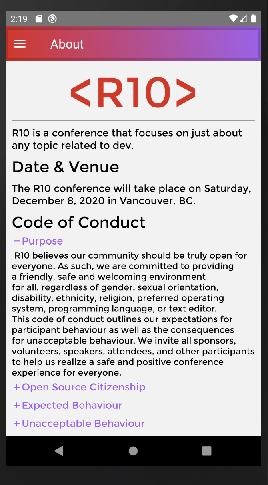
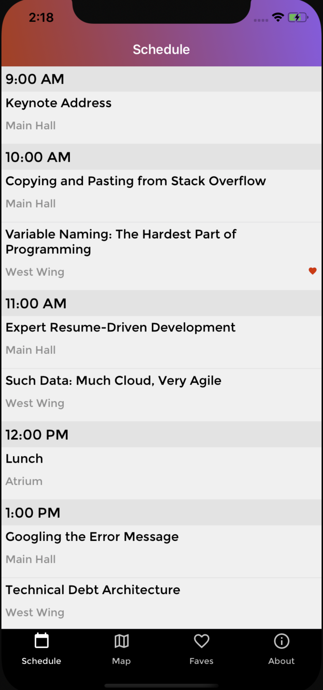
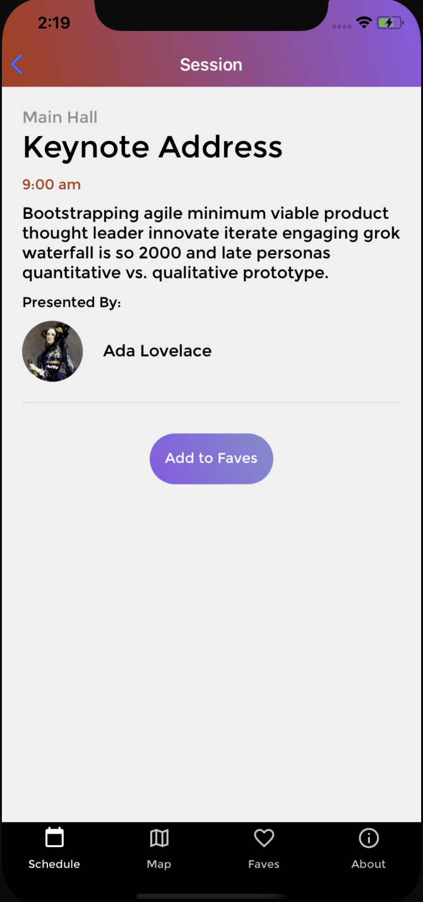

# R10 - Conference Schedule App

A hybrid mobile application for an upcoming developer conference called R10, built with [React-Native](https://reactnative.dev/docs/getting-started) and [React-Navigation](https://reactnavigation.org/). Data access is managed via [Apollo-Client](https://www.apollographql.com/docs/react/).

## App Images

## Installation Instructions

Use the commands below to run R10 in in your local environment:

### Installation

### Install dependencies:

`yarn install`

### Install pods for IOS:

`cd ios && pod install`

### Run iOS

In project root directory:

`react-native run-ios`

or

`yarn run ios`

### Run Android

`react-native run-android`

or

`yarn run android`

## Technologies Used

### GraphQL / Apollo Client

### React-Native

### React Navigation

### Moment.js

## Personal Learnings

- React Native Debugger doesn't always work, but when it does, it's pretty great
- While running both the Android Emulator and the iOS Simulator, it is possible for your MacBook to generate so much heat to literally burn the tips of your fingers
